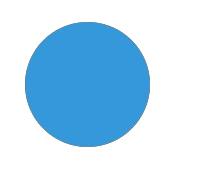
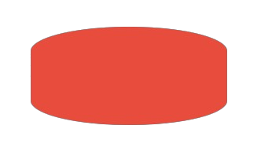
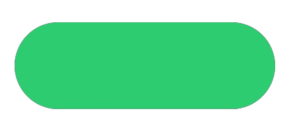
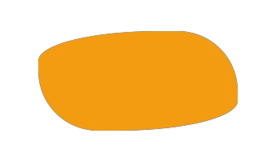
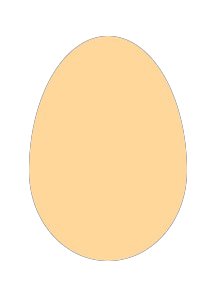
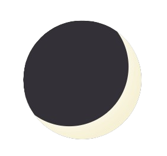
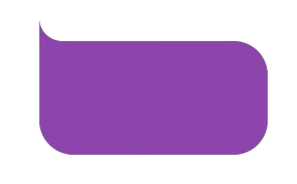

# Drawing Awesome Shapes with Elliptical Border Radius in CSS

Most are familiar with the basic usage of `border-radius` to create circular or rounded shapes but many are unaware of its potential for creating more complex and interesting shapes using elliptical `border-radius`.

## Table of Contents
1. [Understanding Border-Radius](#understanding-border-radius)
2. [Elliptical Border-Radius](#elliptical-border-radius)
3. [Examples](#examples)
    - [Pill Shape](#pill-shape)
    - [Leaf Shape](#leaf)
    - [Egg Shape](#egg)
    - [Moon Shape](#moon)
    - [Speech Bubble](#speech-bubble)
4. [Connect with Me](#connect-with-me)

## Understanding Border-Radius

By setting a uniform value, you can achieve simple rounded corners or circles.


<span class="even-columns">

```css
<!-- Simple rounded corners -->
.circle {
    width: 100px;
    height: 100px;
    background-color: #3498db;
    border-radius: 50%; /* Creates a circle */
}
```

</span>

## Elliptical Border-Radius

 To create an elliptical `border-radius`, you can use two values separated by a slash (`/`):

<span class="even-columns">

```css
.elliptical {
    width: 200px;
    height: 100px;
    background-color: #e74c3c;
    border-radius: 50% / 25%;
}
```

</span>


## Examples
#### By adjusting the values of the elliptical `border-radius`, you can create a variety of unique shapes. Here are a few examples:

## Pill Shape

<span class="even-columns">

```css
.pill {
    width: 300px;
    height: 100px;
    background-color: #2ecc71;
    border-radius: 50px / 50%;
}
```

</span>

## Leaf 

<span class="even-columns">

```css
.leaf {
    width: 200px;
    height: 100px;
    background-color: #f39c12;
    border-radius: 60% 30% / 30% 60%;
}
```

</span>

## Egg 

<span class="even-columns">

```css
.egg {
    width: 126px;
    height: 180px;
    background-color: #FFD79A;
    border-radius: 50% 50% 50% 50% / 60% 60% 40% 40%;
}
```

</span>

## Moon 

<span class="even-columns">


```css
.moon {
    width: 160px;
    height: 160px;
    border-radius: 50%;
    rotate: 45deg;
    background: #F6F1D5;
    position: relative;
    overflow: hidden;
    box-shadow: 0 0 15px rgba(255, 255, 255, 0.8);
}

.moon > *:first-child {
    position: absolute;
    top: 0;
    right: 25px;
    width: 160px;
    height: 160px;
    border-radius: 50%;
    background: #333037; 
    box-shadow: 0 0 20px rgba(255, 255, 255, 0.8);  
}
```

</span>

## Speech bubble 

<span>


```css
.speech-bubble {
  width: 200px;
  height: 100px;
  background-color: #8e44ad;
  border-radius: 0 15% 15% / 0 30% 30%;
  position: relative;
}

.speech-bubble::before {
  content: "";
  position: absolute;
  top: -40px;
  left: 0;
  height: 40px;
  width: 40px;
  border-bottom-left-radius: 50%;
  background-color: transparent;
  box-shadow: 0 20px 0 0 #8e44ad;
}


```

</span>


### Whether you’re designing buttons, icons, or unique decorative elements, elliptical border-radius is a valuable tool in your CSS toolkit.

[View on CodePen](https://codepen.io/ayo_osota/pen/xxoqVWe)

---
> > ### ***"If you believe it, you can achieve it***
> > *The only limit to your success is your imagination"*


**osot💤**
---

### Connect with me:

<span style="font-size: 2rem; display: flex; gap: 2rem;">

  <a class="social-link" href="https://www.linkedin.com/in/ayo-osota/">
  
  </a>

  <a class="social-link" href="https://x.com/ayo_osota/">
  
  </a>

  <a class="social-link" href="mailto:osotaayomikun@gmail.com">
  
  </a>
</span>